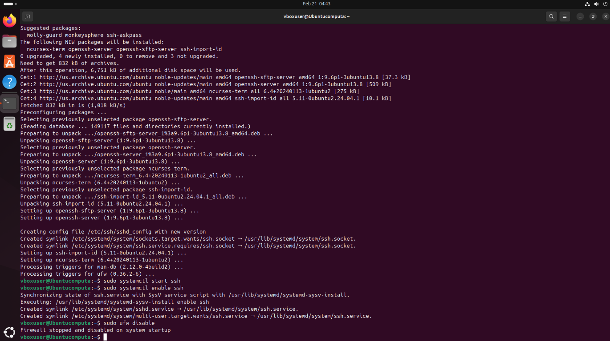
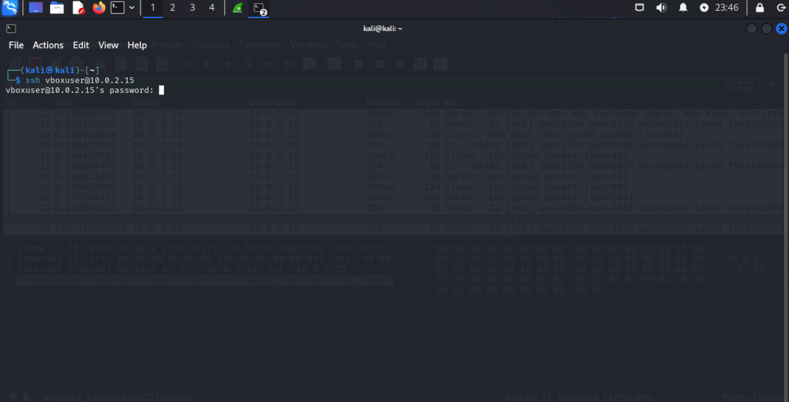
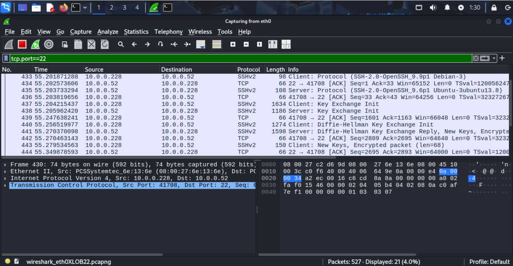
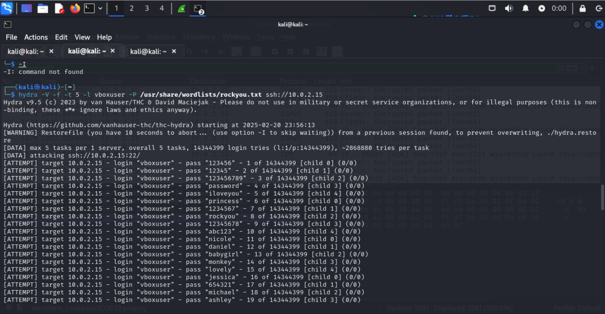
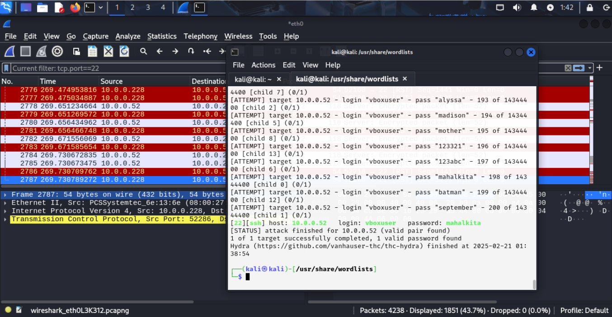
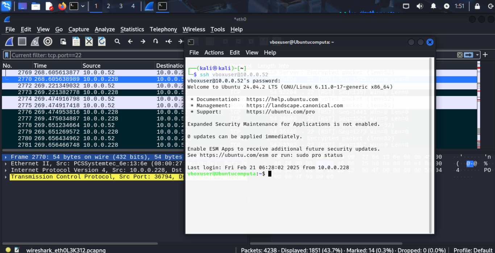
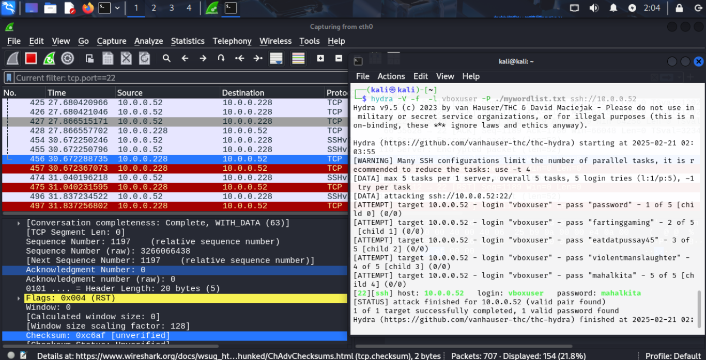
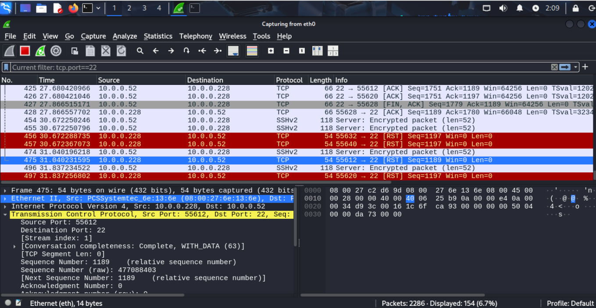

# SSH Brute-Force Attack Simulation (Hydra + Wireshark)

Simulated SSH brute-force attack using Hydra on Kali Linux, with Wireshark packet analysis of the attack and Diffie-Hellman key exchange.

**Tools used:** Kali Linux, Hydra, Wireshark, Ubuntu 24.04

---

## Abstract

Performing Brute Force Password attacks against SSH server using Hydra on Kali Linux. Use Wireshark to capture packets as a result, and analyze the captured packets.

## Introduction

Ubuntu version 24.04 will be used as the victim platform, while the Hydra application on Kali Linux will be used to brute force password attack the victim using a dictionary wordlist, and then after, my own personal wordlist. Password is "MahalKita" (Tagalog for "I love you"). We switched the VMs to bridged network adapters so that way the two different VMs can interact properly as separate entities.

## Setup: Preparing the Victim (Ubuntu)

Firstly, we're simply setting up the attack environment. First, `sudo apt update` ensures that the package list is up to date before installing new software. Then, `sudo apt install openssh-server -y` installs the SSH server without requiring user confirmation (`-y` automatically agrees to installation). `sudo systemctl start ssh` starts the SSH service, allowing remote connections to the system. Finally, `sudo systemctl enable ssh` ensures that the SSH service starts automatically when the system reboots. If SSH is not working, you can check its status with `systemctl status ssh`.

```bash
sudo apt update
sudo apt install openssh-server -y
sudo systemctl start ssh
sudo systemctl enable ssh
systemctl status ssh   # check SSH status if needed
```



Ubuntu uses the **Uncomplicated Firewall (UFW)** to control network traffic, and by default, it may block SSH connections. Running `sudo ufw disable` turns off the firewall completely, allowing unrestricted access to all ports and services. This is useful for testing purposes but makes the system vulnerable, so it should only be done in a controlled lab environment. If you want to allow only SSH while keeping the firewall enabled, you can use `sudo ufw allow ssh` instead. To check the firewall status, use `sudo ufw status`.

```bash
sudo ufw disable
# or, to allow SSH only while keeping the firewall active:
sudo ufw allow ssh
sudo ufw status
```

## Establishing a Baseline Connection

Then we use `ssh username@<insertIp>` in order to establish an SSH connection from the Kali machine to the Ubuntu (victim) machine. The username should match a valid account on the victim machine, and in our screenshot, the user is `vboxuser`, the default for the time being. If the SSH is configured correctly, the terminal will prompt the user to enter a password in order to authenticate in an attempt to ensure that the person logging in is ACTUALLY the person trying to log in; but you know us, we AREN'T. We obviously know the password to the Ubuntu account, but in the event of an actual attack, we will use Hydra in this case, as if we didn't know it.



The initial connection also left us some packets, one significant of the bunch being the Diffie-Hellman exchange, the key exchange algorithm between two parties. The **Diffie-Hellman key exchange** is a cryptographic method that allows two parties to securely share a secret key over an insecure channel. First, both parties agree on a large prime number (p) and a base (g), which are publicly known. Each party then generates a private key, say `a` and `b`, and computes a corresponding public key by raising the base to the power of their private key, modulo the prime (`g^a mod p` for Party A and `g^b mod p` for Party B). They exchange these public keys, and each party can then compute the shared secret by raising the other party's public key to the power of their own private key, modulo p. Despite the public exchange of keys, both parties end up with the same shared secret, as the calculations are mathematically equivalent. The security of this method relies on the difficulty of computing discrete logarithms, making it infeasible for an attacker to derive the shared secret from the public keys.



## Attack: Dictionary Wordlist

Hydra was experiencing some connection throttling, and had failed multiple times around the 40-50 password guess mark, so some modifications needed to be made to the command given to Hydra. We increased the timeouts and retries in order to allow for more time per connection. Used `-t 1` to limit the number of parallel connections. This reduces the load on the SSH server. Used `-w 3` (or higher) to give Hydra a 3-second wait time before retrying failed connections.

```bash
hydra -V -f -l vboxuser -P /usr/share/wordlists/rockyou.txt -t 1 -w 3 ssh://10.0.0.52
```



With a little time and patience, Hydra correctly guesses the password. The address of the victim machine (where the SSH service is running) can be seen, as well as the port number and protocol (22, and SSH). The program made a total of 200 password attempts to access, and the correct attempt of "mahalkita" was made during the 198th. It also displays the time at which the password was correctly guessed: 2025-02-21, at 01:38:54. In Wireshark, the packets caught for the correct password can ALSO be seen: those marked in red signify parts of the correct password guess, as well as the system accepting it in simulation.



When inputting the password into the SSH command, the full system can be accessed.



## Attack: Custom Wordlist

Next, we try the same operation, this time with our own wordlist. We create the wordlist file using the `touch` command and through it we can add our own words to the file:

```bash
echo "password123" >> mywordlist.txt
echo "letmein" >> mywordlist.txt
echo "qwerty" >> mywordlist.txt
```

In this case, I used the words: password, fartinggaming, eatdatpussay45, violentmanslaughter, and the actual password: mahalkita. The resulting program would one by one go through each of these entries, then successfully guess mahalkita, displaying the same information it did prior during the dictionary attempt: the number of guesses, time guessed, as well as the IP and user. New correct password packets can be seen as well.



## Wireshark Analysis

(The virtual machine actually glitched out beyond this point, and I wasn't able to capture the packets relating to the successful password attempt using my own wordlist, so the packets in the submission were a little different than what was displayed during the live attempt.) The packet info displays its source port, as well as the destination port, being port 22, standard for SSH. Another detail I noticed was that there were RED packets where the receiving machine would stop the connection. They were all marked with the brackets `[RST]`, meaning reset — the connection was reset.



## Conclusion

Was this successful? The Hydra brute-force attack on the SSH service was successful in identifying the correct password for the victim system. This was confirmed when Hydra displayed the correct password in the terminal output, indicating that it was able to match one of the passwords from the wordlist to the actual password for the `vboxuser` account on the victim machine.

Hydra was very easy to execute so long as the settings were correct, and it sort of acts like a "floor is lava" way to guess passwords, essentially punishing you significantly for choosing a relatively weak password. Another benefit of Hydra usage is the fact that you don't need many credentials on the victim, just an IP, user, and correct service port.

Some of the drawbacks, however, are the fact that if the victim has a decently strong password, the brute-force process can take an EXTREMELY long time, especially if the server has mechanisms to slow down these attempts — for example, rate limiting, as we saw in that failed attempt. There's also a risk of detection: the attack could surely be detected if the system is monitoring for multiple failed attempts, and will be flagged.

Hydra could be used to brute-force other applications, not just SSH — for example, an HTTP webpage can be attacked via the IP and URL. The Hydra attacks can be prevented by using strong passwords, having an account log-in mechanism, and lastly, with simple multi-factor authentication.

---

*Completed in an isolated virtual lab environment for educational purposes only.*
